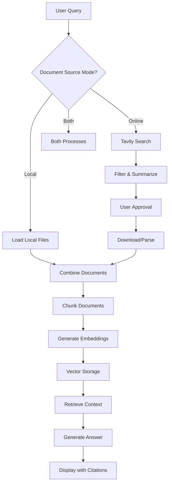

# Agentic RAG System v1.0

A production-ready Retrieval-Augmented Generation (RAG) system with flexible document sourcing, parallel processing, and comprehensive testing infrastructure.

## ✨ Key Features

### 🔄 Flexible Document Sources
- **Online Search**: Fetch up to 100 sources from the web (articles, PDFs, YouTube)
- **Local Upload**: Load documents from your local filesystem
- **Hybrid Mode**: Combine both online and local sources

### 🚀 Performance Optimized
- Parallel document downloading (5 workers)
- Ray-based parallel chunking (4 workers)
- Distributed embedding generation
- Efficient vector storage with ChromaDB

### 📊 Advanced Features
- Source filtering by relevance
- Interactive source approval
- Numeric citations [1], [2,3], [2-5]
- Real-time cost tracking
- Session analytics
- Automatic paywall detection

### 🧪 Production Ready
- Comprehensive test suite (96 tests)
- GitHub Actions CI/CD pipeline
- 70% code coverage requirement
- Type checking and linting

## 📋 Table of Contents

- [Installation](#installation)
- [Quick Start](#quick-start)
- [Document Source Modes](#document-source-modes)
- [Configuration](#configuration)
- [Usage Examples](#usage-examples)
- [Testing](#testing)
- [Project Structure](#project-structure)
- [API Keys](#api-keys)
- [Contributing](#contributing)

## 🔧 Installation

### Prerequisites

- Python 3.12+
- [uv](https://github.com/astral-sh/uv) package manager

### Install Dependencies

```bash
# Clone the repository
git clone <repository-url>
cd agentic-rag

# Install dependencies with uv
uv sync

# Create .env file
cp .env.example .env
# Add your API keys to .env
```

### Required API Keys

Add these to your `.env` file:

```env
OPENAI_API_KEY=your_openai_api_key
TAVILY_API_KEY=your_tavily_api_key
```

## 🚀 Quick Start

### Basic Usage

```bash
uv run main.py
```

### Example Session

```
What would you like to research? Machine learning fundamentals

How would you like to gather documents for your research?
  1. 🌐 Search online (web articles, PDFs, YouTube videos)
  2. 📁 Upload local documents (PDFs, text files)
  3. 🔄 Both (combine online search + local documents)

Enter your choice (1/2/3): 1

[System searches, filters, and presents sources...]
[You approve sources...]
[System processes and generates answer with citations...]
```

## 📚 Document Source Modes

### 1. Online Search Mode

Search and retrieve documents from the web.

**Features:**
- Tavily search (up to 100 sources)
- Relevance filtering
- Source summarization
- User approval workflow
- Automatic download/parsing

**Supported sources:**
- Web articles (parsed HTML)
- PDF documents (downloaded)
- YouTube videos (transcripts)

### 2. Local Upload Mode

Load documents from your local filesystem.

**Features:**
- Directory scanning (recursive optional)
- File preview before loading
- Automatic format detection
- No internet required

**Supported formats:**
- PDF files (`.pdf`)
- Text files (`.txt`)
- Markdown files (`.md`)

**Example:**
```bash
# Create a documents directory
mkdir my_documents
cp *.pdf my_documents/

# Run the system and choose option 2
uv run main.py
# Enter: my_documents/
```

### 3. Hybrid Mode (Both)

Combine online search with local documents.

**Features:**
- All online search features
- All local upload features
- Combined document analysis
- Comprehensive knowledge base

**Best for:**
- Academic research (online papers + personal notes)
- Corporate knowledge (public data + internal docs)
- Validation (cross-reference sources)

See [DOCUMENT_SOURCES.md](DOCUMENT_SOURCES.md) for detailed documentation.

## ⚙️ Configuration

### Edit `config.py`

```python
# Search settings
max_results = 100
relevance_threshold = 0.7

# Chunking
chunk_size = 1000
chunk_overlap = 200

# Retrieval
retrieval_k = 10

# Models
generation_model = "gpt-4o-mini"
embedding_model = "text-embedding-3-small"
```

### Environment Variables

```env
# Required
OPENAI_API_KEY=sk-...
TAVILY_API_KEY=tvly-...

# Optional
CHUNK_SIZE=1000
RETRIEVAL_K=10
```

## 💡 Usage Examples

### Example 1: Research with Online Sources

```bash
uv run main.py
```
```
Query: Latest developments in quantum computing
Mode: 1 (Online)
→ System fetches 100 sources
→ Filters to 30 relevant sources
→ You approve 15 sources
→ Downloads/parses articles
→ Generates comprehensive answer
```

### Example 2: Analyze Local Documents

```bash
uv run main.py
```
```
Query: Summarize key findings from my research papers
Mode: 2 (Local)
Path: ~/Documents/research/
→ Scans directory
→ Finds 20 PDFs
→ Loads all documents
→ Generates summary with citations
```

### Example 3: Hybrid Research

```bash
uv run main.py
```
```
Query: Compare machine learning frameworks
Mode: 3 (Both)
→ Searches online (12 sources approved)
→ Loads local docs (8 PDFs)
→ Analyzes 20 combined documents
→ Generates comprehensive comparison
```

### Example 4: Try the Sample Documents

```bash
uv run main.py
```
```
Query: What features does the RAG system support?
Mode: 2 (Local)
Path: ./example_documents
→ Loads sample_document.txt
→ Generates answer about system features
```

## 🧪 Testing

### Run Tests

```bash
# Run all tests
uv run pytest tests/ -v

# Run unit tests only
uv run pytest tests/unit -m unit

# Run with coverage
uv run pytest tests/ --cov=src --cov-report=html

# View coverage report
open htmlcov/index.html
```

### Test Suite

- **96 total tests**
  - 79 unit tests
  - 17 integration tests
- **Test coverage**: 70% minimum requirement
- **CI/CD**: GitHub Actions on every push/PR

See [tests/README.md](tests/README.md) for detailed testing documentation.

## 📁 Project Structure

```
agentic-rag/
├── main.py                      # Main entry point
├── config.py                    # Configuration
├── .env                         # API keys (create from .env.example)
├── README.md                    # This file
├── DOCUMENT_SOURCES.md         # Document source modes guide
├── TESTING_SUMMARY.md          # Testing infrastructure overview
│
├── src/
│   ├── ingestion/              # Document loading and processing
│   │   ├── web_search.py       # Tavily search client
│   │   ├── local_document_loader.py  # Local file loading
│   │   ├── article_downloader.py     # Parallel downloading
│   │   ├── pdf_loader.py       # PDF extraction
│   │   ├── text_loader.py      # Text file loading
│   │   ├── yt_bot.py           # YouTube transcripts
│   │   └── chunker.py          # Document chunking
│   │
│   ├── vectorstore/            # Embeddings and vector storage
│   │   ├── embeddings.py       # OpenAI embeddings
│   │   ├── chroma_store.py     # ChromaDB integration
│   │   └── parallel_embedding.py  # Ray parallelization
│   │
│   ├── generation/             # Answer generation
│   │   └── answer_generator.py  # RAG answer generation
│   │
│   └── utils/                  # Utilities
│       ├── cost_tracker.py     # API cost tracking
│       ├── cli_display.py      # User interface
│       └── logging_config.py   # Logging setup
│
├── tests/                      # Test suite
│   ├── unit/                   # Unit tests (79 tests)
│   ├── integration/            # Integration tests (17 tests)
│   ├── conftest.py            # Shared fixtures
│   └── README.md              # Testing documentation
│
├── example_documents/          # Sample documents for testing
│   └── sample_document.txt
│
├── data/                       # Data directory (created at runtime)
│   ├── downloads/             # Downloaded articles
│   ├── chroma_db/            # Vector database
│   └── analytics.json        # Session analytics
│
└── .github/
    └── workflows/
        └── ci.yml             # GitHub Actions CI/CD
```

## 🔑 API Keys

### OpenAI API Key

1. Sign up at [platform.openai.com](https://platform.openai.com)
2. Navigate to API Keys
3. Create new secret key
4. Add to `.env` file

**Cost estimates:**
- Embeddings: ~$0.0001 per query
- Generation: ~$0.0006 per 1K output tokens
- Typical session: $0.10-$0.30

### Tavily API Key

1. Sign up at [tavily.com](https://tavily.com)
2. Get API key from dashboard
3. Add to `.env` file

**Features:**
- 100 searches per month (free tier)
- Advanced search depth
- Paywall detection
- Source metadata

## 🎯 Workflow



## 💰 Cost Tracking

The system tracks API costs in real-time:

- OpenAI API calls (embeddings + generation)
- Tavily search calls
- Per-session breakdown
- Historical analytics

View costs at end of each session or in `data/cost_log.json`.

## 🚦 CI/CD Pipeline

### GitHub Actions Workflow

- **Test Job**: Runs on Python 3.11 & 3.12
- **Lint Job**: Code formatting checks
- **Type Check Job**: Static type analysis
- **Build Job**: Package verification

### Triggers

- Push to `main`, `dev`, `feature/*`
- Pull requests to `main`, `dev`

See [.github/workflows/ci.yml](.github/workflows/ci.yml) for configuration.

## 📊 Features in Detail

### Parallel Processing

- **Parallel Downloads**: 5 concurrent workers for article downloading
- **Ray Chunking**: 4 workers for document chunking
- **Distributed Embeddings**: Batch processing with Ray actors

### Citation Format

The system uses academic-style numeric citations:

```
Machine learning is a subset of AI [1]. Recent advances include
transformers [2,3] and diffusion models [4-6].

## Sources
[1] https://example.com/ml-intro
[2] https://arxiv.org/paper1
[3] https://arxiv.org/paper2
...
```

### Source Filtering

- Relevance scoring with embeddings
- Duplicate URL detection
- Paywall detection (online sources)
- Accessibility checks

## 🐛 Troubleshooting

### Common Issues

**"No module named 'src'"**
```bash
# Run from project root with uv
uv run main.py
```

**"Missing API keys"**
```bash
# Check .env file exists and has keys
cat .env
```

**"Ray failed to start"**
```bash
# Check Ray is installed
uv sync
```

**"No supported documents found"** (Local mode)
```bash
# Check file extensions and path
ls -R your_documents_directory/
```

## 🤝 Contributing

### Development Setup

```bash
# Install dev dependencies
uv sync

# Run tests
uv run pytest

# Run linting
uv run ruff check src/

# Run type checking
uv run pyright src/
```

### Adding Features

1. Create feature branch
2. Write tests first (TDD)
3. Implement feature
4. Ensure tests pass
5. Submit pull request

### Code Style

- Follow PEP8
- Add type hints
- Write docstrings
- Keep functions focused

## 📖 Documentation

- [DOCUMENT_SOURCES.md](DOCUMENT_SOURCES.md) - Document sourcing modes guide
- [TESTING_SUMMARY.md](TESTING_SUMMARY.md) - Testing infrastructure
- [tests/README.md](tests/README.md) - Testing guide
- [config.py](config.py) - Configuration options

## 📜 License

[Add your license here]

## 🙏 Acknowledgments

- OpenAI for GPT and embeddings
- Tavily for web search API
- ChromaDB for vector storage
- Ray for distributed processing
- LangChain for document processing

## 📞 Support

For issues and questions:
- Open an issue on GitHub
- Check existing documentation
- Review test examples

## 🗺️ Roadmap

### Planned Features

- [ ] Support for more document formats (DOCX, HTML)
- [ ] Conversation memory (multi-turn dialogue)
- [ ] Web UI (Gradio/Streamlit)
- [ ] Export answers to PDF/Markdown
- [ ] Advanced analytics dashboard
- [ ] Batch query processing
- [ ] Custom embedding models
- [ ] Hybrid search (vector + keyword)

### Recent Updates

- ✅ **v1.0** - Initial release
  - Flexible document sources (online/local/both)
  - Parallel processing with Ray
  - Comprehensive test suite
  - CI/CD pipeline
  - Numeric citations
  - Cost tracking

## 📈 Performance

Typical performance metrics:

- **Online search**: 30-60 seconds for 100 sources
- **Document loading**: 1-2 seconds per PDF
- **Chunking**: 5-10 seconds for 20 documents (parallel)
- **Embedding**: 10-20 seconds for 500 chunks
- **Answer generation**: 10-30 seconds

Total session: 2-5 minutes (varies by source count)

---

Made with ❤️ by the Agentic RAG Team
